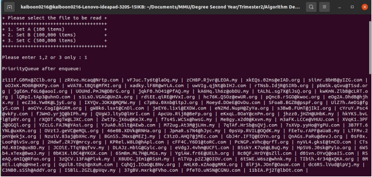
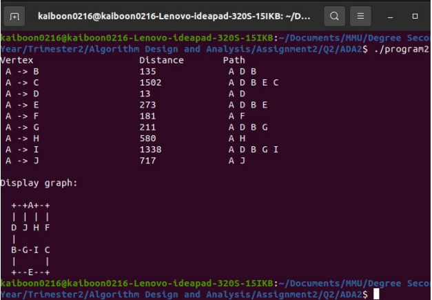

# Algorithm Design and Analysis
Implementation of some algorithms for my university assignment under Algorithm Design and Analysis subject

This repo can be divided into 2 parts where:
1. Assignment 1 included the implementation of Hash Table, AVL Binary Search Tree and Priority queue using Heap algorithms
2. Assignment 2 included the implementation ofm Display and Sort, Shortest Paths and Minimum Spanning Tree algorithms

For more info, please refer to the documentation pdf file in the reference folder

# How to start this program
1. Make sure your pc can compile c++ code, if not please install latest gcc via this [link](https://preshing.com/20141108/how-to-install-the-latest-gcc-on-windows/)
2. Clone this repo
3. Navigate to the algorithm folder you want to run, execute the c++ file via this command gcc sourcefile_name.c -o outputfile.exe on cmd/terminal
4. Run the compiled exe file with this command outputfile.exe on cmd/terminal

# Sample image of this program

